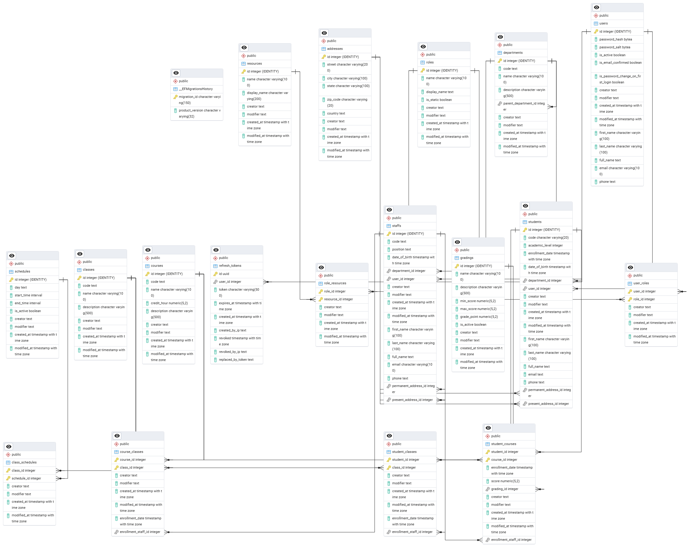

# Learn Well University
This is a simple university course management domain project, where includes student, instructor and staff to manage the courses and classes and enrollemnts

## Prerequisites
* Dotnet 9
* Docker
* Angular v20
* Code Editor (Visual Studio 2022 recommended)

## Tech Insights
* Clean Architecture
* Generic Repository Pattern
* Unit of Work
* Generic CRUD Apis (See details bellow how to use it)
* Postgres
* SEQ

## Getting Started
This has applciation has two external docker container dependencies, we need to ensure this two docker container service is runing. Here are the following docker command.


### Run by docker commands (mannual)
```
docker run --name learnwelluniversity.seq -d -p 5341:80  -e ACCEPT_EULA=Y  -e SEQ_FIRSTRUN_ADMINPASSWORD=pass123   datalust/seq 

docker run --name learnwelluniversity.db -e POSTGRES_PASSWORD=pass123 -p 5433:5432 -d postgres //

```
* Clone and open the server code in visual studio and select **Conatiner profile** by setting the WebApi project as startup. Then build and run the server project.
* Make sure you have updated your appsetting.Development.json as following
```
DefaultConnection": "Host=host.docker.internal;Port=5433;Database=LearnWellUniversityDb;Username=postgres;Password=pass123; //Connect your web api project to docker containarized postgres database are publicly exposed

"Serilog":"WriteTo":"Args":"serverUrl": "http://host.docker.internal:5341" //This ensure to write logs into SEQ server.
```

### Run by container orchestration
Make sure you have the following configurations updated into appsettings.Development.json
```
DefaultConnection": "Host=postgres;Port=5433;Database=LearnWellUniversityDb;Username=postgres;Password=pass123;

"Serilog":"WriteTo":"Args":"serverUrl": "http://seq:80"
```
Now run the following commands
```
docker compose -p learnwelluniversity up -d --build

```

### In both cases, you can check the following urls to see the output:
* SEQ: http://localhost:5341
* Web Api: https://localhost:7105 //make sure you are using https

### Web API Login
```
//Admin Login
Username: admin@user.email
Password: Admin@1!
```
Start playing with apis from swagger UI

## ER Diagram

</img>


